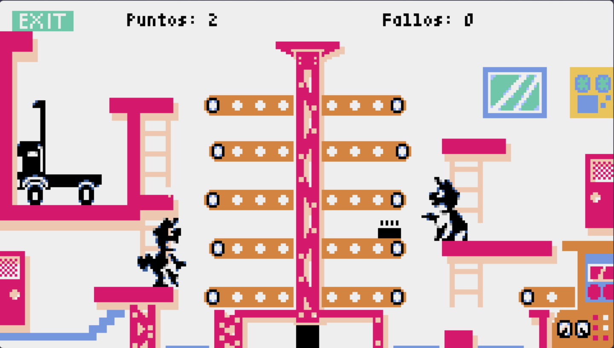

# Super Mario Bros – Pyxel



Este proyecto implementa un juego arcade 2D desarrollado con Pyxel.

## Instalacion
Clona este repositorio.
```bash
git clone https://github.com/vid4l-07/Mario-Bros.git
```

Instala Pyxel:
```bash
pip install pyxel
```

Ejecuta el juego:
```bash
python main.py
```

## Manual de Usuario

### Controles

| Acción | Tecla |
|-------|----------|
| Mover Mario arriba | ↑ |
| Mover Mario abajo | ↓ |
| Mover Luigi arriba | W |
| Mover Luigi abajo | S |
| Abrir/cerrar menú | M |
| Seleccionar opción en menú | ↑ / ↓ + Enter |
| Salir del juego | Q |

*En modo Crazy los controles se invierten.*


## Objetivo del juego

- Mantener los paquetes moviéndose correctamente a lo largo de las cintas para que lleguen al camión.

### Evita que caigan:
- Si un jugador no está en el nivel adecuado para interceptar un paquete, se produce un fallo.  
- Con **3 fallos**, se pierde.


## Cómo se juega

1. Elige dificultad desde el menú.  
2. Los paquetes aparecen en la primera cinta.  
3. Cada cinta mueve los paquetes hacia la siguiente.  
4. Mario controla las cintas del lado derecho y Luigi las del izquierdo.  
5. Sitúa al personaje en el nivel que corresponde cuando un paquete llega al final.  

Si el jugador está en la posición correcta:
- Se suma un punto.  
- Se activa una animación breve del personaje.

Si falla:
- Se reproduce una animación con el jefe Mario.
- Aumenta el contador de fallos.

Cada 8 paquetes entregados al camión se realiza un *reparto* que puede:
- Reducir fallos
- Aumentar dificultad progresivamente

El juego continúa hasta acumular **3 fallos**.

## Diseño e Implementación del Juego

El juego está organizado en varias clases que encapsulan comportamientos específicos:

### 1. Clase **Imagen**
- Gestiona la carga, posición y renderizado de imágenes extraídas del spritesheet Pyxel (`.pyxres`).
- Se utiliza tanto para personajes, paquetes, camión, mapa y animaciones.

### 2. Clase **Menu**
Controla el menú inicial del juego:
- Navegación con teclas ↑ y ↓  
- Confirmación con Enter  
- Alternar visibilidad con tecla **M**  
- Opciones de dificultad: *Fácil, Medio, Extremo, Crazy*

### 3. Clase **Jugador**
Representa a Mario y Luigi.  
Cada jugador tiene:
- Varias posiciones posibles (niveles verticales)
- Dos animaciones por nivel (idle y acción)
- Teclas asignadas para subir/bajar
- Un sistema de animación dependiente de la velocidad de la cinta desde la que recoge el paquete  
- Comunicación con las animaciones especiales del jefe Mario (fallos)

### 4. Clase **Cinta**
Simula las cintas transportadoras:
- Cada cinta tiene paquetes que avanzan por pasos
- Control de velocidad configurable por dificultad
- Dirección (izquierda o derecha)
- Nivel asignado para verificar si el jugador está en la posición correcta
- Comprueba caídas y transfiere paquetes a la siguiente cinta

### 5. Clase **Camion**
Acumula paquetes entregados al final del sistema de cintas.  
Una vez se llenan **8 paquetes**:
- Se reinicia el contador
- Aumenta el número de repartos realizados
- Puede reducir fallos cometidos según la dificultad

### 6. Clase **Animacion**
Controla animaciones complejas cuadro por cuadro (por ejemplo, cuando Mario o Luigi fallan y el jefe aparece enfadado).  
Mientras la animación esté activa, el juego se detiene.

### 7. Clase **Partida**
Es el núcleo del videojuego.  
Se encarga de:
- Generación progresiva de paquetes
- Actualización de cintas
- Control de puntuación, fallos y dificultad
- Envío de paquetes al camión
- Gestión de animaciones especiales
- Reinicio parcial de parámetros según avance del juego  

La dificultad afecta a:
- Velocidad de cintas
- Número de cintas activas
- Frecuencia de paquetes mínimos
- Reglas para perdonar fallos
- Mapeo de controles (especialmente en modo Crazy)

### 8. Clase **Juego**
Gestiona el ciclo principal de Pyxel:
- Inicialización
- Carga de recursos
- Bucle principal `update()` y `draw()`
- Activación del menú y creación de nuevas partidas
